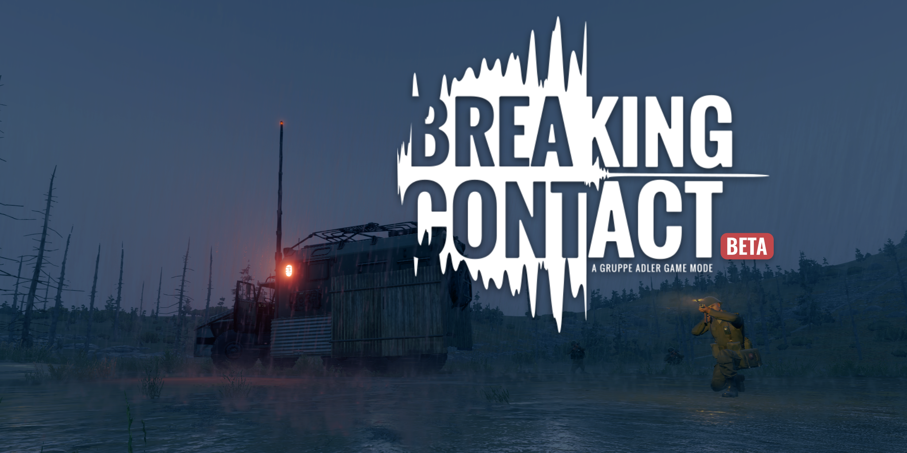

# Breaking Contact

A Team vs. Team (TvT) gamemode for **Arma Reforger** by [Gruppe Adler](https://gruppe-adler.de).


## Concept

Breaking Contact is an asymmetric gamemode where two factions compete over radio transmissions:

- **OPFOR (USSR)** must complete a set number of radio transmissions using a mobile radio truck. They choose where to position the truck and must protect it while it transmits.
- **BLUFOR (US)** must locate and neutralize the radio truck before all transmissions are completed. They spawn at a configurable distance from OPFOR and must hunt down the truck.

## Game Flow

```
LOADING ─► PREPTIME ─► OPFOR PHASE ─► BLUFOR PHASE ─► GAME ─► GAMEOVER ─► REPLAY
```

1. **Prep Phase** - Players join and pick their faction.
2. **OPFOR Phase** - OPFOR selects a spawn position and direction for the radio truck.
3. **BLUFOR Phase** - A command vehicle spawns automatically on a road at the configured distance from OPFOR.
4. **Game Phase** - OPFOR starts transmissions. BLUFOR hunts them down. Win conditions are checked every second.
5. **Game Over** - A replay visualizes all player movements and projectile trajectories on the map.

## Win Conditions

| Condition | Winner |
|---|---|
| All transmissions completed | OPFOR |
| Radio truck destroyed by BLUFOR | OPFOR (destroyer loses) |
| Radio truck destroyed by OPFOR | BLUFOR (destroyer loses) |
| Radio truck disabled/captured by BLUFOR | BLUFOR |
| All BLUFOR players eliminated | OPFOR |
| All OPFOR players eliminated | BLUFOR |

Faction elimination can be disabled via the mission header for solo testing.

## Components

The gamemode is built from three components attached to the `PS_GameModeCoop` entity:

| Component | Purpose |
|---|---|
| `GRAD_BC_BreakingContactManager` | Core gamemode logic: phases, spawning, win conditions, transmission tracking |
| `GRAD_BC_ReplayManager` | Records player/vehicle positions and projectile trajectories for post-game replay |
| `GRAD_BC_AmbientVehicleManager` | Spawns ~50 civilian vehicles on roads for ambient traffic |

Additionally, `GRAD_BC_TransmissionComponent` is attached to each spawned antenna and manages the transmission state machine (OFF, TRANSMITTING, INTERRUPTED, DISABLED, DONE).

## Mission Header Configuration

Missions use the vanilla `SCR_MissionHeader` class. Breaking Contact-specific settings are configured via the `missionHeader` section in the server's JSON config file.

### Custom Fields

| Field | Type | Default | Description |
|---|---|---|---|
| `m_aTrafficVehicleOverrides` | `array<ResourceName>` | *(empty)* | Override list of vehicle prefabs for ambient traffic. If empty, vehicles are auto-detected from the civilian faction catalog. |
| `m_sCivilianFactionKey` | `string` | `"CIV"` | Faction key used to auto-detect civilian vehicles when no override list is set. |
| `m_bDebugLogs` | `bool` | `false` | Enable verbose debug logging for all Breaking Contact components. Disable for production. |
| `m_bSkipFactionElimination` | `bool` | `false` | Skip faction elimination win conditions. Useful for solo testing on a dedicated server so the game does not end immediately. |

### Vehicle Resolution Priority

When determining which vehicles to spawn as ambient traffic:

1. **Mission header override** (`m_aTrafficVehicleOverrides`) - explicit list of prefabs
2. **Faction catalog** - auto-detected from the faction specified by `m_sCivilianFactionKey`
3. **Component defaults** - hardcoded fallback prefabs in `GRAD_BC_AmbientVehicleManager`

### Example Config with All Options

```json
{
    "missionHeader": {
        "m_aTrafficVehicleOverrides": [
            "{2B6CC81E0A0B70EE}Prefabs/Vehicles/Wheeled/S1203/S1203_transport.et",
            "{EF07C1E1DC44C5BE}Prefabs/Vehicles/Wheeled/S105/S105.et",
            "{3C2F5E2EC735917C}Prefabs/Vehicles/Wheeled/UAZ469/UAZ469_covered_CIV.et"
        ],
        "m_sCivilianFactionKey": "CIV",
        "m_bDebugLogs": 0,
        "m_bSkipFactionElimination": 0
    }
}
```

### Minimal Config

A minimal configuration using all defaults (no Breaking Contact-specific overrides needed):

```json
{
    "missionHeader": {}
}
```

### Solo Testing Config

For testing alone on a dedicated server without immediate game-over from elimination:

```json
{
    "missionHeader": {
        "m_bSkipFactionElimination": 1,
        "m_bDebugLogs": 1
    }
}
```

## Component Attributes

These attributes are set on the components in the World Editor (not in the `.conf` file) and control core gameplay parameters:

### GRAD_BC_BreakingContactManager

| Attribute | Default | Range | Description |
|---|---|---|---|
| Transmission Count | `2` | 1-3 | How many transmissions OPFOR needs to complete to win |
| Transmission Duration | `900` (15 min) | 1-600 | Duration of each transmission in seconds |
| BLUFOR Spawn Distance | `3000` (3 km) | 1000-10000 | How far BLUFOR spawns from OPFOR in meters |
| Notification Duration | `10` | 1-30 | How long notifications are displayed in seconds |

### GRAD_BC_ReplayManager

| Attribute | Default | Description |
|---|---|---|
| Recording Interval | `1.0` | Seconds between recorded frames |
| Record Projectiles | `true` | Whether to record bullet/grenade trajectories |
| Max Projectile Distance | `500` | Maximum distance to record projectiles (meters) |
| Max Replay Duration | `60.0` | Target replay length in seconds (speed adapts automatically) |

## Maps

Breaking Contact ships with two maps:

- **Everon** (`BC_everon.ent`)
- **Kolgujev** (`BC_kolgujev.ent`)

## License

By Gruppe Adler.
